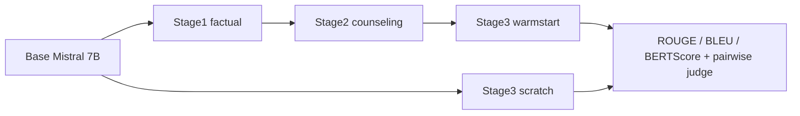

# Sleep LLM Fine-tuning

수면 상담 데이터를 지식형·상담형·통합형으로 나누어 Mistral 7B 계열 모델의 단계적 파인튜닝과 평가 결과를 비교한 보고서 기반 실험 기록입니다.

**핵심 역량: 데이터 분포 단계화, warmstart/scratch 비교, 자동 지표와 LLM-judge의 차이 해석.** 학습 코드·데이터·체크포인트는 미확보이며 공개본은 결과 전사와 실험 설계 문서입니다.

## Project Overview

RAG 서비스의 검색 지연 연구에서 다루지 못한 생성 품질을 별도 실험으로 검토했습니다. Stage1은 지식 설명형, Stage2는 상담형, Stage3는 통합 분포입니다. Stage3에서 base부터 학습하는 scratch와 이전 상담 체크포인트에서 이어 학습하는 warmstart를 비교합니다.

## Recruiter Snapshot

| 항목 | 내용 |
| --- | --- |
| 유형 | 데이터 마이닝 과목의 LLM 도메인 적응 실험 |
| 역할 | 임나경 단독 명의 보고서의 실험 설계·분석. 코드별 기여 확인 필요 |
| 기술 | 보고서의 base_mistral7b, ROUGE/BLEU/BERTScore, gpt-4o-mini judge |
| 데이터 | 수면 지식형/상담형/통합형 데이터. 출처·분할·규모 확인 필요 |
| 핵심 구현 | 단계별 fine-tuning 및 Stage3 초기화 전략 비교; 구현 원본 미확보 |
| 결과 | 보고서상 Stage3 judge FT 선호율 warmstart 0.90, scratch 0.92 (각 50쌍) |

## Architecture

다음은 보고서의 실험 설계이며 학습 코드로 검증된 실행 그래프가 아닙니다.



## Tech Stack

보고서에서 확인한 모델명과 평가 지표만 기재합니다. Transformers/PEFT/LoRA/QLoRA/PyTorch의 사용 여부와 버전, 정확한 모델 저장소 ID는 확인 필요입니다. RAGAS는 본 실험에서 제외했다고 명시되어 있습니다.

## Key Features

- 답변 성격이 다른 데이터 → factual/counseling/full로 단계 구분 → 각 분포에서 base 대비 결과 비교.
- 학습 초기화 전략 선택 → warmstart와 scratch 비교 → ROUGE/BLEU와 BERTScore의 선택 기준 차이 검토.
- 문자열 유사도만으로 상담 품질 해석 곤란 → pairwise judge 추가 → 평가 모델 편향과 소표본 한계도 함께 기록.

## How It Works

문제 정의 → 단계별 데이터 구성 → 파인튜닝 → 참조 답변 기반 자동 평가 → base/FT 답변 쌍 평가 → 전략별 해석 순서입니다. 결측·중복 제거, train/test 분할, 오염 검사, 학습률, epoch, seed와 judge 프롬프트는 보고서에서 복구할 수 없어 TODO로 남깁니다.

## My Contribution

2025-12-15 단독 명의 보고서는 단계적 실험과 평가 분석을 기술합니다. 학습 소스 미확보 상태에서 직접 작성한 모듈, 코드량, 특정 튜닝 라이브러리 사용을 단정하지 않습니다.

## Results

**아래는 보고서 인쇄 pp.7–12의 값이며 재학습 결과가 아닙니다.**

| 비교 | base ROUGE-1 | FT ROUGE-1 | base BERTScore F1 | FT BERTScore F1 | FT judge 선호율 |
| --- | ---: | ---: | ---: | ---: | ---: |
| Stage1 | 0.3159 | 0.3939 | 0.7860 | 0.8199 | 0.66 |
| Stage2 | 0.2701 | 0.3161 | 0.7609 | 0.7856 | 0.74 |
| Stage3 warmstart | 0.2740 | 0.2985 | 0.7634 | 0.7664 | 0.90 |
| Stage3 scratch | 0.2740 | 0.3041 | 0.7634 | 0.7648 | 0.92 |

Judge는 gpt-4o-mini, 각 50쌍으로 보고되며 Stage1 invalid 1건이 있습니다. Stage3의 0.90 대 0.92는 서로 다른 전략 각각의 **base 대비 선호율**이며 warmstart와 scratch의 직접 대결 결과가 아닙니다. 통계적 우월성, 의료 안전성, 실제 수면 개선 효과를 입증하지 않습니다.

[보고된 결과 CSV](data/reported-evaluation.csv)에는 ROUGE/BLEU/BERTScore와 judge 값을 보존했습니다.

## Getting Started

```bash
git clone https://github.com/YIM551/sleep-llm-finetuning.git
cd sleep-llm-finetuning
```

README와 CSV를 읽을 수 있는 문서 저장소입니다. 학습 실행 명령이나 requirements를 임의로 만들지 않았습니다. [재현성 체크리스트](docs/reproducibility.md)의 원본을 확보해야 학습·평가를 재실행할 수 있습니다.

## Project Structure

`data/reported-evaluation.csv`: 결과 전사 / `data/README.md`: 출처 / `docs/reproducibility.md`: 누락 정보 / `docs/publication-notes.md`: 공개 범위.

## Technical Challenges

문제: 생성 품질은 지연 지표로 설명되지 않음 → 접근: 분포별 파인튜닝과 복수 지표 → 관찰: Stage3 scratch는 ROUGE-1이 높고 warmstart는 BERTScore가 조금 높음 → 교훈: 단일 점수로 전략을 선택하기 어렵습니다. 이 차이가 상담 안전성·의미 안정성을 원인적으로 입증한다는 해석은 보류합니다.

## Limitations

학습·평가 코드와 데이터 미확보, checkpoint/환경 버전 부재, judge 50쌍의 소표본, 평가 프롬프트·답변 순서 편향 미검증이 핵심 한계입니다. 보고서의 단계별 결과는 서로 다른 분포에서 측정되어 단계 진행만으로 성능이 누적 향상됐다고 단정할 수 없습니다.

## Future Work

정확한 모델 ID·데이터 출처·분할·seed와 체크포인트 복구, 평가 누수 검사, 다중 judge/답변 순서 교환, 블라인드 사람 평가, 검색 품질과 생성 품질 공동 측정을 우선합니다.

## References

「수면 상담 도메인에서 단계적 LLM 파인튜닝의 효과 분석: 자동 지표 및 LLM-judge 기반 평가」, 2025-12-15, 인쇄 pp.5–7, 7–12, 16–17. 개인정보 및 원본 이미지 공개 권한 확인 전 PDF는 미공개.
