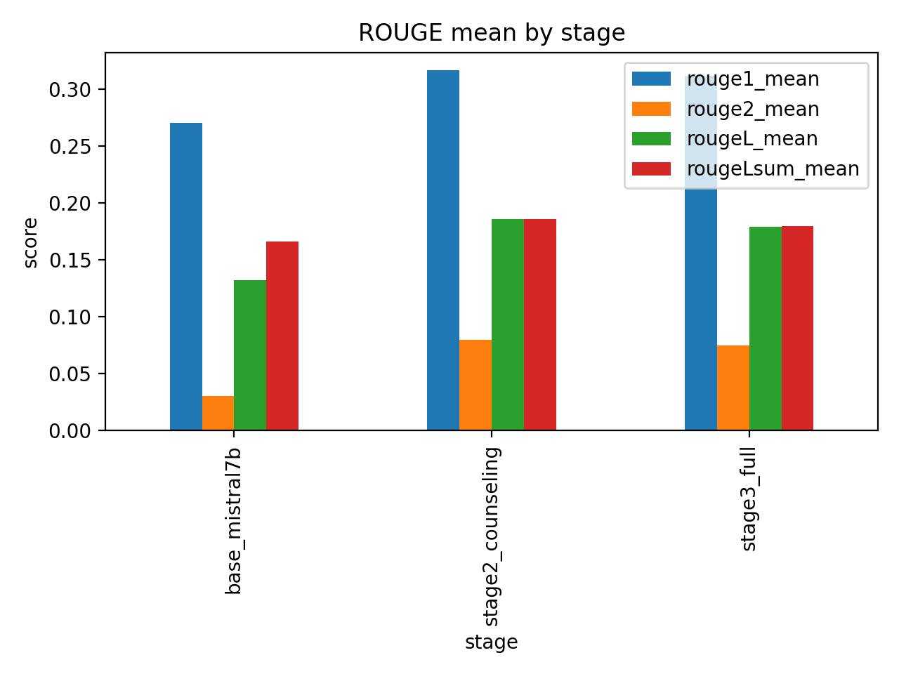

# 수면 상담 LLM 파인튜닝과 평가 신뢰성 분석

의료·상담 질문에 대한 생성 답변을 단계별로 비교하고, 자동 평가 점수와 LLM 평가가 달라지는 이유를 분석한 개인 데이터 마이닝 프로젝트입니다.

| 항목 | 내용 |
|---|---|
| 문제 | 검색 지연만으로는 수면 상담 답변의 품질을 설명하기 어려움 |
| 역할 | 개인 과제의 단계별 실험 설계·평가 도구 구성·결과 분석 |
| 기술 | Python, Transformers, PEFT, NF4/LoRA, ROUGE, BLEU, BERTScore, LLM judge |
| 핵심 구현 | 지식형/상담형 JSONL 전처리, adapter 학습 코드, 답변 평가·정제·결과 집계 |
| 대표 결과 | 저장된 Stage2 자동 평가 ROUGE-1 **0.2701→0.3161**, 유효 **188/200**건 |
| 검증 | 기존 점수 14 개 그룹·judge 결정 8 개 파일 재집계 일치, 오프라인 테스트 19 개 통과 |
| 읽기 순서 | [Architecture](docs/architecture.md) · [실험과 실패 분석](docs/experiments.md) · [모델/학습 설정](docs/fine-tuning.md) |



2025 년에 저장된 결과 그림입니다. 이번에 모델을 다시 학습한 결과가 아닙니다. **Stage3 설정은 Mistral-7B-Instruct-v0.3, Stage1/2 기본 설정은 Llama-3-8B-Instruct 여서 실행 모델의 연결은 추가 확인이 필요합니다.** 높은 judge 선호율에는 정답을 이용한 외부 모델 후처리가 섞여 있어 파인튜닝 단독 효과로 해석하지 않습니다.

## Overview / Problem

[RAG 수면 상담 프로젝트](https://github.com/YIM551/rag-sleep-assistant)에서 다루지 못한 생성 품질을 별도 분석했습니다. 참조 문장과 비슷한 답변이 상담 관점에서도 더 좋은지, 지식형·상담형 데이터를 어떻게 학습시키는 것이 나은지 확인하려 했습니다. 연구·교육 목적이며 의료 진단을 대체하지 않습니다. 이 adapter 가 실제 서비스에 연결되었다는 증거는 확보하지 못했습니다.

## Solution / Key Features

- 서로 다른 schema 를 `instruction/input/output` JSONL 로 통일하는 [전처리](historical/git-20251214/src/prepare_datasets.py).
- NF4 4bit base 와 rank64 LoRA 를 사용하는 [원 학습 코드](historical/git-20251214/src/train_qlora.py), factual/counsel/curriculum 설정 보존.
- [자동 지표](historical/git-20251214/tools/collect_eval_metrics.py), [pairwise judge](historical/submission-20251215/tools/pairwise_judge.py), 후처리와 결과 비교 도구 복구.
- **2026 년 추가:** 기존 결과 재집계·파일 hash·원 config 호환성 검사. 과거 실험과 신규 검증을 분리합니다.

## Architecture / Data Flow


원 trainer 의 흐름입니다. Stage3 YAML 은 이 trainer 와 호환되지 않으며 위 경로의 실행 성공을 입증하지 않습니다. 별도 `refine_2pass` 경로는 [상세 구조](docs/architecture.md)에서 분리합니다.

## Tech Stack / My Contribution

원 의존성은 Transformers `>=4.40.0`, PyTorch, Datasets, Accelerate, bitsandbytes, PEFT, SentencePiece, PyYAML 입니다. 평가 도구는 pandas/evaluate/sacrebleu/bert-score/matplotlib/OpenAI SDK 도 사용하나 당시 완전한 lock 은 없습니다.

수면 상담의 생성 품질 문제를 개인 과제로 확장하고 단계별 데이터·초기화 전략 및 평가 방법을 비교했습니다. 복구 자료의 출처는 [provenance](docs/provenance.json)에 남겼습니다. 팀 서비스 전체 구현이나 상용 운영을 개인 성과로 주장하지 않습니다.

## Dataset / Implementation

전처리 코드에서 의료 QA·대화 데이터 **8 개 로드 대상**을 확인했습니다. 예: `Malikeh1375/medical-question-answering-datasets`, `lavita/MedQuAD`, `avaliev/chat_doctor`. 실패한 source 를 건너뛰므로 실제 사용 개수·최종 학습 행 수는 확인 필요입니다. `80,000/120,000`은 구성의 샘플 상한입니다. [ID·라이선스·schema](docs/dataset.md)를 기록하고 제 3 자 의료 원문은 재배포하지 않습니다.

원본을 `historical/git-20251214/`와 `historical/submission-20251215/`로 분리했습니다. 핵심 알고리즘은 재작성하지 않았습니다. 신규 [`check_training_config.py`](scripts/check_training_config.py)는 비활성 단계·미사용 warmstart 필드와 YAML `no`의 boolean 변환을 모델 로드 전에 드러냅니다.

## Experiments / Evaluation / Results

| 과거 자동 평가 | 유효/전체 | base ROUGE-1 | candidate ROUGE-1 | base BERTScore F1 | candidate F1 |
|---|---:|---:|---:|---:|---:|
| Stage1 |185/200|0.3159|0.3939|0.7860|0.8199|
| Stage2 |188/200|0.2701|0.3161|0.7609|0.7856|
| Stage3 warmstart |180/200|0.2740|0.2985|0.7634|0.7664|
| Stage3 scratch/full |180/200|0.2740|0.3041|0.7634|0.7648|

[원 summary CSV](historical/submission-20251215/reports/)를 보존했습니다. Stage 별 평가 분포가 달라 행끼리 누적 성능 비교를 하면 안 됩니다. `scratch`는 사전 학습된 base 에서 시작한다는 뜻이고 `full` 명칭이 전체 파라미터 학습을 증명하지 않습니다.

**실패도 남겼습니다.** 초기 base 대 Stage2/Stage3 judge 에는 candidate **0/188**, **0/50** 결과가 있고, 정제된 Stage2 대 Stage3 는 **91 승/57 승/동률 40**입니다. 후속 Stage2 74%, Stage3 90/92%는 **정답 Reference 를 GPT-4o-mini 에 주고 두 번 재작성한 후보**의 선호율입니다. 순수 FT·일반화·의료 안전성의 성과 수치로 사용하지 않습니다. [실행별 전체 결과와 해석](docs/experiments.md).

## Demo

실제 보존된 결과 그림 40 개, 자동 점수와 익명화된 판정 기록을 [Demo 안내](docs/demo.md)에서 볼 수 있습니다. 모델 대화 시연 영상이나 배포된 fine-tuned endpoint 는 확보하지 못했습니다. [개인정보를 제거한 원 보고서](docs/reports/course-report-anonymized.pdf)는 당시 해석을 보존한 자료이며 현재 판단은 [정정 문서](docs/experiments.md)를 우선합니다.

## Getting Started

Python3.10 이상에서 저장된 결과를 오프라인으로 검증합니다.

```bash
git clone https://github.com/YIM551/sleep-llm-finetuning.git
cd sleep-llm-finetuning
python scripts/verify_historical_results.py
python -m pip install -r requirements-audit.txt
python -m unittest discover -s tests -v
```

[현재 검증 보고서](docs/validation/offline-verification.json). GPU·모델 다운로드·유료 API 호출은 없습니다. 다음 두 검사는 **누락/불일치가 있어 종료 코드 1**을 반환합니다.

```bash
python scripts/check_training_config.py historical/git-20251214/configs/exp_stage3_full_warmstart.yaml
python scripts/check_run_manifest.py experiments/historical-stage1.json
```

가중치·학습 데이터·정합한 runner·환경을 복구하기 전에는 원 학습 명령을 성공 가능한 실행 절차로 안내하지 않습니다. [재현 범위와 명령](docs/reproducibility.md).

## Project Structure

`historical/`: 원 source/config/tools/결과 두 snapshot · `scripts/`, `tests/`: 2026 년 검증 도구 · `docs/`: 구조/데이터/실험/공개출처/검증 결과 · `data/`: 당시 보고서 전사본 · `experiments/`: 불완전한 실제 실행 메타데이터.

## Technical Challenges / Limitations

모델/config/평가 라벨의 연결, Stage3 필드 불일치, 참조답안 노출 후처리, 반복 key 와 train/test 분리 부재를 발견했습니다. 학습 환경·checkpoint·GPU 메모리·학습 시간·loss 는 아직 복구하지 못했습니다. **저장 점수 재집계 성공과 모델 학습 재현 성공을 구분합니다.**

## Future Work

checkpoint 와 데이터 분할 hash 를 복구하고 동일 held-out 질문에서 정답 노출 없는 base/FT 생성과 동일 후처리 조건을 비교합니다. judge 답변 순서 교환·다중 평가자·블라인드 사람 평가를 적용하고 상담 위험 응답도 별도로 평가합니다.

## References

[Mistral 공식 모델 카드](https://huggingface.co/mistralai/Mistral-7B-Instruct-v0.3) · [LoRA 논문](https://arxiv.org/abs/2106.09685) · [QLoRA 논문](https://arxiv.org/abs/2305.14314) · [데이터 출처](docs/dataset.md) · [공개 범위](docs/publication-notes.md). 과거 source commit 은 `e86159a177f0a8b56c76c9d2dc72634184359557`, Stage3 구성 추가는 `54708b3`입니다.
