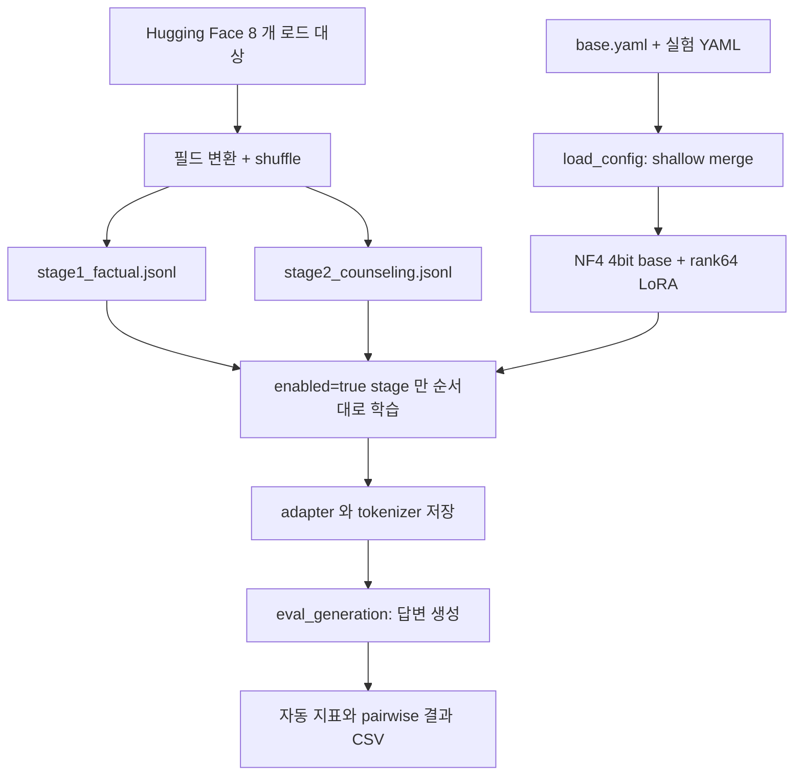
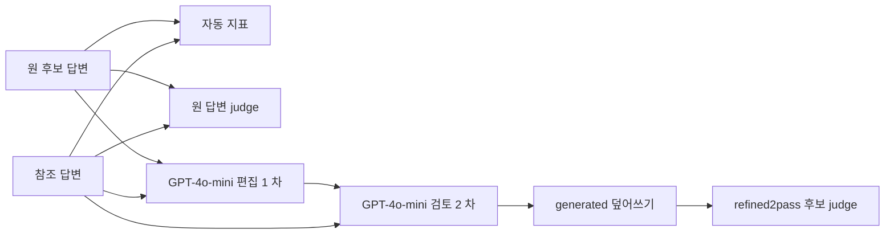

# 구현과 데이터 흐름

[prepare_datasets.py](../historical/git-20251214/src/prepare_datasets.py)는 source 별 상한만큼 seed42 로 shuffle/select 한 뒤 JSONL 로 합친다. 실패한 source 는 warning 후 skip 한다. 독립 test 분할이나 환자/대화 단위 중복 제거는 없다.

[train_qlora.py](../historical/git-20251214/src/train_qlora.py)는 base 를 한 번 만들고 활성 stage 를 순회한다. factual-only 와 counsel-only 는 별도 실행, curriculum 만 factual→counsel 두 단계를 같은 model 객체로 이어간다. 모든 실험이 순차 누적 학습은 아니다. prompt 는 `User:/Assistant:` 문자열이고 공식 chat template 호출이 없다. labels 는 입력 전체를 복사하므로 assistant-only loss masking 도 아니다.

Stage3 YAML 의 train_file/중첩 train/lora/init_adapter_dir/resume_from_checkpoint 는 보존된 trainer 가 읽지 않는다. enabled/file 이 없어 학습 단계 0 개가 선택된다. [구성 상세](fine-tuning.md).

## 평가와 참조답안 노출 경로

[refine_2pass.py](../historical/submission-20251215/tools/refine_2pass.py)는 평가의 Reference 를 생성 후처리에도 노출한다. 이 경로에서 얻은 선호율은 FT 생성 단독의 일반화 성능이 아니다. 후처리기/평가자에 같은 모델 계열을 쓰는 편향도 고려한다.

입출력은 JSONL, config 는 YAML, 점수는 CSV/JSON, figure 는 PNG 다. 이 실험 자체에는 DB/웹 endpoint/동시사용자 처리 구현이 없다. 코드가 RAG 와 같은 과거 repository 에 있었다는 사실은 adapter 배포·라우팅·실사용을 입증하지 않는다.
